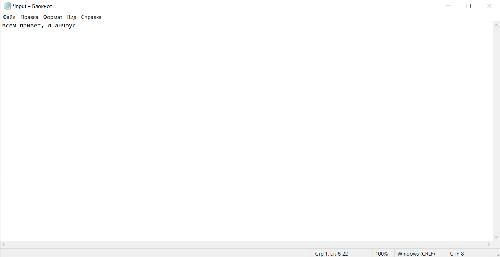
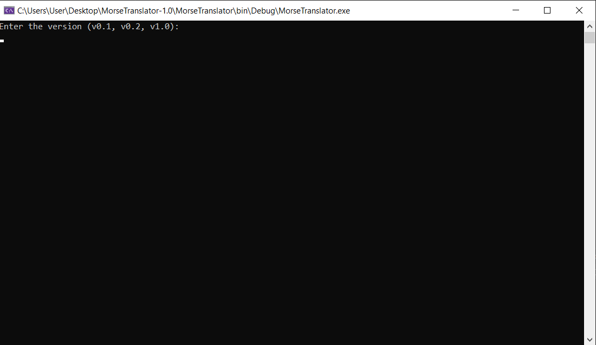
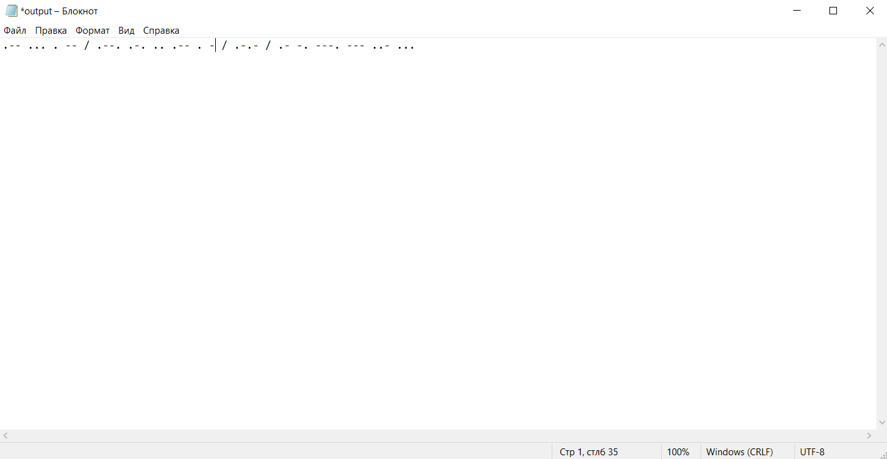

# MorseTranslator

[](https://www.youtube.com/watch?v=dQw4w9WgXcQ&ab_channel=RickAstley)
[](https://github.com/yourusername/MorseTranslator/actions)

MorseTranslator is a C# console application that translates plain text into Morse code. The project supports both English and Russian languages, and also offers the ability to play audio signals for Morse code.

---

## Table of Contents

- [Description](https://www.youtube.com/watch?v=dQw4w9WgXcQ&ab_channel=RickAstley)
- [Releases](#releases)
- [Installation and launch](#installation-and-launch)
- [Test launch](#test-launch)
- [Project Structure](#project-structure)
- [License](#license)

---

## Description

The MorseTranslator has worked with the application of translations of clean code (DRY, KISSING, HARD). The project was created in stages, starting with the basic functionality and gradually expanding, which is reflected in the commit history.

**Project Features:**

- **File input/output:**  
  The main text is taken from the book "input.txt ", and then it is written to `output.txt `.
- **Multi-language support:**  
  It is translated for both English (version 0.1) and Russian text (version 0.2). With mixed input, the vocabulary selection logic is applied.
- **Audio support (version 1.0):**  
  The final version implements the playback of audio signals for dots and dashes using multithreading.
- **Clean and maintainable code:**  
  All logic is divided into classes (file manager, Morse code translator, sound player, constants).

---

## Releases

### v0.1 – Basic English Morse Translator

- **Description:**  
  Translates English text into Morse code.
- **Main Features:**
- Convert letters and numbers from English text to Morse code.
  - Reading from `input.txt ` and writing the result to `output.txt `.
- **How to use:**  
  Write down the text in English in `input.txt ` and launch the app.

---

### v0.2 – Russian Language Support

- **Description:**  
  Extends the functionality of the application by adding support for the Russian language.
- **Main functions:**
- Translation of Russian text using a separate dictionary.
  - Mixed input processing: first we try to use a Russian dictionary, then English.
- **How to use:**  
  Write down the text (in Russian or mixed) in `input.txt `, select the version `v0.2` at startup.

---

### v1.0 – Sound Playback and Final Polish

- **Description:**  
  The final version, which includes audio accompaniment and improvements to the purity of the code.
- **Main Functions:**
- Audio signal playback: short signal for dot, long signal for dash.
  - Using multithreading to play audio without blocking the main stream.
  - Complete code refactoring: all "magic" strings and numbers are converted to constants.
  - Updated documentation, ready-made release builds (.zip and .exe), a detailed history of commits.
- **How to use:**  
  Enter the text in `input.txt `, select the `v1.0` version at startup and enjoy both visual and audio output.

---

## Installation and launch

### Cloning a repository

```bash
git clone https://github.com/yourusername/MorseTranslator.git
```
```bash
cd MorseTranslator
```

### Build and launch
- **JetBrains Rider:**
  - Open the project in Rider.
  - Make sure that the working directory is set to the folder with the executable file (usually bin/Debug/net X.X).
  - Run the project through Run/Debug Configurations.
- **The command line:**
  
  ```bash
  dotnet build
  ```
  ```bash
  dotnet run
  ```

### Preparing the input file
- Create a file input.txt in the working directory (usually the folder with the .exe file) and put the text for translation there.

### Viewing the result
- The translation result will be saved in a file output.txt.

---

## Test launch
  
The project has a set of unit tests. **Important:** If you are using JetBrains Rider, you may experience incompatibilities with the Microsoft.VisualStudio.TestTools.UnitTesting library, as it is optimized for Visual Studio. 
In this case, you can:

**Upgrade to NUnit or xUnit:**

  - Update the test project by replacing the [TestClass] and [TestMethod] attributes with equivalents from the selected framework (for example, [TestFixture] and [Test] for NUnit).
  - Set up a test runner in Rider to support the selected framework.
    
Run the tests through the Unit Tests window in Rider.

---

## Demo

### 1. Input file example


### 2. Console interaction
  

### 3. Output result
  

### Video-tutorial
[](https://www.youtube.com/watch?v=dQw4w9WgXcQ&ab_channel=RickAstley)

---

## Project structure

```
MorseTranslator/
├── bin/
│   ├── Debug/
│   │   ├── input.txt
│   │   ├── output.txt
│   │   ├── MorseTranslator.exe
├── README.md
├── input.txt
├── output.txt
├── MorseTranslator.sln
├── src/
│   ├── Constants.cs
│   ├── FileManager.cs
│   ├── MorseTranslator.cs
│   └── SoundPlayer.cs
└── tests/
    └── MorseTranslatorTests.cs
```

--- 

## License 

This project is licensed under the MIT License.
